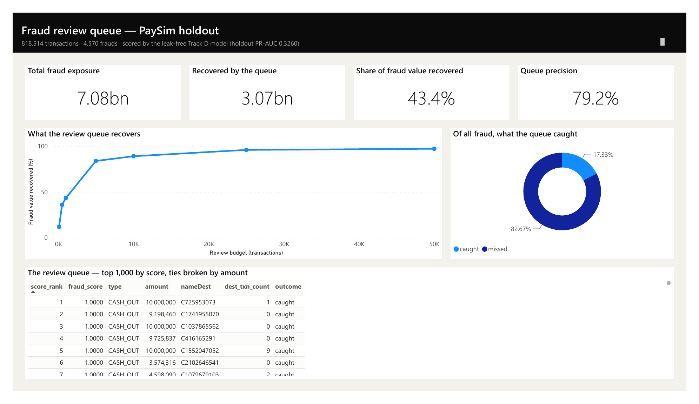
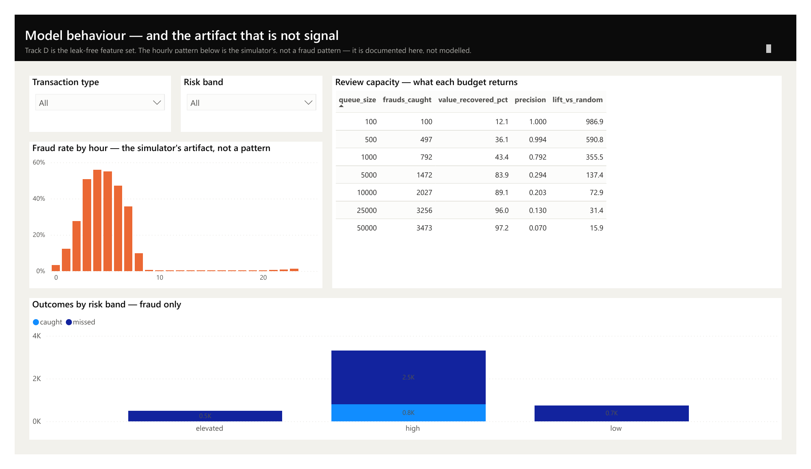

# Fraud Detection on PaySim — a leakage audit

Most published work on the PaySim mobile-money dataset reports 99%+ accuracy on fraud
detection. This project reproduces that result, then demonstrates that **roughly 85% of
it comes from the dataset encoding its own answer**, and establishes what performance
actually survives once the leakage is removed.

| Track | Artifact removed | Random Forest | XGBoost |
|---|---|---|---|
| **A** | nothing — the standard approach | 1.0000 | **1.0000** |
| **B** | origin-side balance drain | 0.7841 | **0.7888** |
| **C** | + destination-balance leak | 0.4223 | **0.5412** |
| **D** | + hour-of-day artifact | 0.1497 | **0.3260** |

(PR-AUC on a held-out temporal window; no-skill floor 0.0056.)

Track A achieves a perfect PR-AUC, with **zero** false positives across 818,514 test
transactions. That is not a good model — it is a model reading the label.

Track D is the defensible number. Gradient boosting more than doubles it over the Random
Forest (0.1497 → 0.3260), which says the signal surviving the audit is real but strongly
non-linear — reachable only by a model that can express deep feature interactions.

---

## The three artifacts

### 1. Fraud drains the account exactly

`amount == oldbalanceOrg` identifies **8,034 of 8,213 frauds (97.8%)** with **zero** false
positives out of 2,762,196 legitimate transactions. PaySim's simulated fraudster empties
the account outright, so a single `if` statement outperforms most published models.

Removing the flag alone is insufficient — a model holding both `amount` and
`oldbalanceOrg` relearns the equality, and `newbalanceOrig == 0` encodes the same fact.
Every origin-side balance column has to go.

### 2. The mule account is never credited

For TRANSFER transactions, **99.29%** of fraud has `newbalanceDest == 0`, against **0.21%**
of legitimate transactions. The simulator moves money out without crediting the recipient.

This one is transaction-type specific: for CASH_OUT the same comparison gives 0.56% vs
0.51% — no signal at all — which confirms it is a simulator bug rather than a fraud
pattern. `errorBalanceDest` inherits the leak, since it is derived from the same column.

### 3. PaySim's fraudsters never sleep


Fraud is generated at a near-constant **274–375 transactions per hour** around the clock —
a 1.4x range. Legitimate volume swings **1,259x**, from 299,591 at 7pm down to 238 at 4am.

So the night-time fraud rate (7.29%) towers over the daytime rate (0.19%) mostly because
real users are asleep. A model leaning on `hour_of_day` would be badly miscalibrated
against production traffic, where night volume is a substantial fraction of daytime rather
than 0.08% of it. Removing this single feature costs more than half the remaining PR-AUC
(0.4223 → 0.1497).

---

## Results in detail

Trained on steps 1–323, evaluated on steps 324–743 — a temporal split, so the model never
sees a transaction occurring after the one it scores. The test window holds 818,514
transactions with 4,570 frauds (0.5583%) at the real class balance.

**Rule baselines**

| Baseline | Precision | Recall | TP | FP |
|---|---|---|---|---|
| Full-balance-drain rule | 1.0000 | 0.9768 | 4,464 | 0 |
| PaySim's own `isFlaggedFraud` | 1.0000 | 0.0028 | 13 | 0 |

**Models** (Random Forest, at a threshold chosen on the validation window)

| Track | Precision | Recall | F1 | PR-AUC | TP | FP | FN | Oracle F1 |
|---|---|---|---|---|---|---|---|---|
| A | 1.0000 | 0.9985 | 0.9992 | 1.0000 | 4,563 | 0 | 7 | 0.9999 |
| B | 0.7366 | 0.7361 | 0.7363 | 0.7841 | 3,364 | 1,203 | 1,206 | 0.7805 |
| C | 0.8573 | 0.2024 | 0.3275 | 0.4223 | 925 | 154 | 3,645 | 0.4315 |
| D | 0.1618 | 0.3512 | 0.2215 | 0.1497 | 1,605 | 8,315 | 2,965 | 0.2306 |

The last column is what an *impossible* threshold — the F1-optimal one, picked with
knowledge of the test labels — would have scored. The gap between it and the reported F1
is the cost of not having an oracle, and it widens as the feature set gets honest: 0.0007
on the leaking Track A, 0.0091 on Track D. Earlier versions of this table reported the
oracle column as the result.


At its operating point Track D catches 35% of fraud at roughly five false alarms per catch —
whether that is useful depends entirely on the cost of a manual review, which is the
framing a fraud team would actually apply. Note that the threshold trades recall for
precision differently on each track, so PR-AUC remains the fair cross-track comparison;
the operating-point columns describe one particular choice on each curve.

Logistic Regression degrades far faster than Random Forest across every track
(0.9981 → 0.0837), indicating the residual signal is non-linear: thresholds and
interactions rather than monotone relationships.

---

## What it is worth operationally

PR-AUC judges the model as a classifier. A fraud team uses it as a *ranker*, working a
review queue of fixed size — so the operational question is what reviewing the top-K
scored transactions recovers versus picking K at random.

| Review budget | % of test window | Frauds caught | % of fraud value | Precision | Lift vs random |
|---|---|---|---|---|---|
| 100 | 0.01% | 100 | 12.1% | 1.000 | **987x** |
| 500 | 0.06% | 497 | 36.1% | 0.994 | 591x |
| 1,000 | 0.12% | 792 | 43.4% | 0.792 | 355x |
| 5,000 | 0.61% | 1,472 | 83.9% | 0.294 | 137x |
| 25,000 | 3.05% | 3,256 | 96.0% | 0.130 | 31x |

Total fraud exposure in the test window is 7,075,665,126. Reviewing **1,000 of 818,514
transactions — 0.12% of volume — recovers 43.4% of it**, and the first 100 reviews are
100% precise.

This is the gap between a metric and a decision. A 0.3260 PR-AUC sounds like a failed
model; the same model at a realistic queue size is a 355x improvement on random
selection. Which framing is correct depends on what the model is for.

One implementation detail worth naming: the model assigns many transactions *identical*
scores, so "top 1,000" is ambiguous unless the tie-break is specified — different sort
implementations shift the reported catch rate by several percent with no change to the
model. Ties here are broken by transaction amount descending: at equal risk, the larger
exposure is reviewed first. That rule lives in one place, `src/scoring.py`, and the API,
the batch scorer and the capacity analysis all call it; they previously each had their
own copy, and two of them had drifted.

`advanced_models.py --review-cost` turns the table into a decision. At an assumed 500 per
manual review, a 1,000-transaction queue recovers 3,072,905 of fraud value *per review
performed* — so every budget in the grid clears its own cost by three orders of magnitude,
and net value is still rising at 50,000 reviews. That is a statement about PaySim's
transaction sizes more than about the model: the simulator's frauds average roughly 1.5M
each, so almost any review cost is dominated. On real traffic the same computation is
where a model this weak either earns its keep or does not.

---

## Scoring service

The leak-free model is served behind a FastAPI endpoint. Every response carries the SHAP
contributions behind the score, because a bare probability gives an analyst no basis to
act — "0.83" is not a reason to freeze an account, but "0.83, driven by a large transfer
into a previously-empty destination account" is something a human can verify.

```bash
python src/build_api_bundle.py      # package model + destination-frequency map
python -m uvicorn src.api.main:app  # then open http://127.0.0.1:8000/docs
```

```
POST /score
{"type": "TRANSFER", "amount": 1500000, "nameDest": "C999999999", "oldbalanceDest": 0}

→ {"fraud_probability": 0.9761,
   "risk_band": "high",
   "drivers": [{"feature": "oldbalanceDest", "value": 0.0,
                "shap_contribution": 2.5327, "direction": "increases risk"},
               {"feature": "log_amount", "value": 14.221,
                "shap_contribution": 1.7265, "direction": "increases risk"}, ...],
   "caveat": "... Holdout PR-AUC is 0.33. Suitable for ranking a manual review queue;
               not for automated blocking."}
```

The service deliberately serves **Track D**, not Track A. Track A would demo at a perfect
1.0000, but it reaches that by reading a leaked label — shipping it would undo the point
of the audit. Each response states the model's real holdout PR-AUC rather than letting a
caller assume it is better than it is.

`/health` reports what is loaded and how it scored; `/score/batch` ranks up to 1,000
transactions at once.

---

## Power BI dashboard

Two pages, built on the scored holdout window. The first answers the question a fraud
operations lead actually asks; the second shows what the model is doing and names the
artifact it refuses to model.



The queue catches **17.3% of fraud cases but recovers 43.4% of fraud value** at a
1,000-transaction budget. That gap is the point: the queue ranks by risk and breaks ties
by amount, so the cases it does catch are the expensive ones. A count-based read of the
same model looks like failure; a value-based read is what the review budget is bought for.



The hourly chart is on the page deliberately. It is the simulator's artifact, documented
so a reader can see why it was removed from the feature set rather than discovering its
absence and assuming an oversight.

Build it with `dashboard/build_pbip.py`, open the generated `.pbip` in Power BI Desktop
and save as `.pbix`. The `.pbix` is gitignored — it embeds the full data model and runs
to about 38 MB.

---

## Method notes

**Temporal split, not random.** A random split lets the model learn from transactions that
occur after the ones it scores. The split point is chosen at 70% of *rows* rather than 70%
of the step range, because transaction volume collapses in later steps while fraud stays
constant — a range split would leave the test window with roughly 10x the training fraud
rate.

**Subsampling on the training set only.** Training uses 20 legitimate rows per fraud; the
test set keeps the true 0.5583% balance. Metrics measured on a rebalanced test set are not
meaningful.

**Destination-frequency features fitted on the training window only.** Counting account
appearances across the full dataset would tell the model the future.

**The decision threshold is chosen on validation, not on test.** Hyperparameters were
always selected on a window carved off the end of the training period — but the operating
threshold was not. An earlier version picked the F1-optimal threshold against the test
labels, which is an oracle no production scorer has. PR-AUC is threshold-free and was
never affected, so the Track A→D argument stands unchanged; but every precision, recall
and F1 figure was optimistic. The threshold now comes from the same validation window as
the hyperparameters, and each result also records `oracle_f1` — what an impossible
test-tuned threshold would have reached — so the size of that gap is reported rather than
hidden. It was the fourth artifact in the audit, and it was in the audit's own code.

**Accuracy is never reported.** At this class balance, predicting "never fraud" scores
99.44% while catching nothing.

---

## Repository layout

```
src/
  data_prep.py     CSV -> SQLite, chunked for constant memory over 6.3M rows
  eda.py           SQL-driven exploratory analysis (Week 1)
  features.py      four nested feature sets, one per artifact removed
  train.py         temporal split, training, evaluation across all tracks
  evaluate.py      metrics and plots
  scoring.py       risk bands and review-queue ordering, defined once
  advanced_models.py  XGBoost tuning, IsolationForest, SHAP, capacity analysis
  build_api_bundle.py packages model + frequency map for serving
  score_batch.py      scores the holdout window into a Power BI feed
  api/main.py         FastAPI scoring service
  queries.sql      the SQL behind the Week 1 findings
tests/
  test_leakage.py    the audit's claims, as executable assertions
  test_features.py   feature arithmetic and pipeline integrity
  test_scoring.py    banding and queue-ordering conventions
  test_evaluate.py   metrics, against hand-computed cases
  test_api.py        the scoring service, against a real model
dashboard/
  build_pbip.py    generates the Power BI project (open in Desktop, save as .pbix)
  README.md        Power BI build guide, with DAX measures
reports/
  eda_findings.md    Week 1 - dataset characteristics and the first leak
  week2_results.md   Week 2 - the full leakage audit
  figures/           all plots
```

## Tests

```bash
pip install -r requirements.txt -r requirements-dev.txt
pytest
```

108 tests, ~7 seconds, no dataset required — they run against a miniature PaySim built in
`tests/conftest.py` that reproduces all three artifacts deliberately.

The point of them is narrow. This project's argument is that a feature list quietly
encoding the answer invalidates everything downstream, and that argument was defended only
by prose. `tests/test_leakage.py` turns it into assertions: that Track D contains no
origin-balance, destination-balance or timing column; that the four tracks are strictly
nested, so the PR-AUC gap between any two prices exactly one artifact; that the temporal
windows never overlap; that destination frequencies are fitted on training only; and that
the threshold-selection window is carved from training rather than test.

A guard that can pass vacuously is not a guard, so the fixture is itself checked: the
synthetic fraud rows must actually carry the drain signature and the uncredited-mule
pattern, or the leakage tests would be asserting against data that cannot leak.

## Reproducing

```bash
pip install -r requirements.txt
# Download 'Synthetic Financial Datasets For Fraud Detection' (ealaxi/paysim1)
# from Kaggle and place the CSV at data/raw/paysim.csv
python src/data_prep.py        # ~40s, builds a 700MB SQLite database
python src/eda.py              # ~30s, Week 1 findings and plots
python src/train.py            # ~4min, all four tracks
python src/advanced_models.py  # ~6min, XGBoost, IsolationForest, SHAP, capacity
python src/build_api_bundle.py # packages the Track D model for serving
python src/score_batch.py      # ~1min, scores the holdout into the Power BI feed
python dashboard/build_pbip.py # generates the Power BI project
```

The last step writes `dashboard/FraudDashboard.pbip`. Open it in Power BI Desktop and
save as `dashboard/fraud_dashboard.pbix` — a `.pbix` is a compiled Analysis Services
database, so only Power BI itself can write one. The generated project already carries
both tables, their data types, and all eight DAX measures.

The trained models and the API bundle are gitignored, so a fresh clone has to run
`train.py` and `advanced_models.py` before `build_api_bundle.py` has anything to package.

## Unsupervised detection and SHAP

An IsolationForest trained only on legitimate transactions — never shown a fraud label —
reaches 0.0277 PR-AUC, roughly 5x random but about 12x worse than the supervised model on
identical features. On this data, labels are doing most of the work.

SHAP on the Track D model ranks `oldbalanceDest` (1.22) well ahead of `is_transfer` (0.82)
and `log_amount` (0.77), with `dest_is_frequent` contributing exactly zero — a feature
worth dropping.

## Limitations

`log_amount` remains in Track D and is still partly downstream of the drain mechanic, since
fraudulent amounts equal account balances by construction. Amount is a standard fraud
feature and removing it would be over-correcting, but Track D should not be read as
entirely artifact-free.

More broadly: these findings characterise **PaySim**, not fraud. The dataset is synthetic,
and the leakage documented here is a property of its generator. Conclusions about model
performance do not transfer to production fraud systems.

## Data source

Lopez-Rojas, E. A., Elmir, A., & Axelsson, S. (2016). *PaySim: A Financial Mobile Money
Simulator for Fraud Detection.* 28th European Modeling and Simulation Symposium (EMSS).
Dataset: [kaggle.com/datasets/ealaxi/paysim1](https://www.kaggle.com/datasets/ealaxi/paysim1) ·
Simulator: [github.com/EdgarLopezPhD/PaySim](https://github.com/EdgarLopezPhD/PaySim)

## Roadmap

- [x] Week 1 - data pipeline and exploratory analysis
- [x] Week 2 - baseline models and leakage audit
- [x] Week 3 - gradient boosting, unsupervised detection, SHAP, and review-capacity analysis
- [x] Week 4 - FastAPI scoring service and Power BI monitoring dashboard
