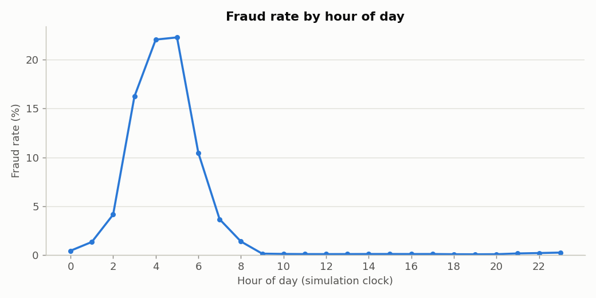
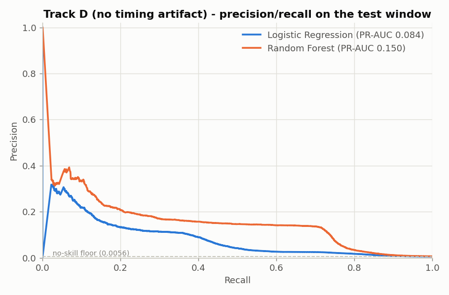

# Fraud Detection on PaySim — a leakage audit

Most published work on the PaySim mobile-money dataset reports 99%+ accuracy on fraud
detection. This project reproduces that result, then demonstrates that **roughly 85% of
it comes from the dataset encoding its own answer**, and establishes what performance
actually survives once the leakage is removed.

| Track | Artifact removed | PR-AUC | Best model |
|---|---|---|---|
| **A** | nothing — the standard approach | **1.0000** | Random Forest |
| **B** | origin-side balance drain | **0.7836** | Random Forest |
| **C** | + destination-balance leak | **0.4229** | Random Forest |
| **D** | + hour-of-day artifact | **0.1501** | Random Forest |

Track A achieves a perfect score with **one** false negative and **zero** false positives
across 818,514 test transactions. That is not a good model — it is a model reading the
label. Track D is the defensible number: weak in absolute terms, but a **27x lift** over
the 0.0056 no-skill floor.

---

## The three artifacts

### 1. Fraud drains the account exactly

`amount == oldbalanceOrg` identifies **8,034 of 8,213 frauds (97.8%)** with **zero** false
positives out of 2,762,196 legitimate transactions. PaySim's simulated fraudster empties
the account outright, so a single `if` statement outperforms most published models.

Removing the flag alone is insufficient — a model holding both `amount` and
`oldbalanceOrg` relearns the equality, and `newbalanceOrig == 0` encodes the same fact.
Every origin-side balance column has to go.

### 2. The mule account is never credited

For TRANSFER transactions, **99.29%** of fraud has `newbalanceDest == 0`, against **0.21%**
of legitimate transactions. The simulator moves money out without crediting the recipient.

This one is transaction-type specific: for CASH_OUT the same comparison gives 0.56% vs
0.51% — no signal at all — which confirms it is a simulator bug rather than a fraud
pattern. `errorBalanceDest` inherits the leak, since it is derived from the same column.

### 3. PaySim's fraudsters never sleep



Fraud is generated at a near-constant **274–375 transactions per hour** around the clock —
a 1.4x range. Legitimate volume swings **1,259x**, from 299,591 at 7pm down to 238 at 4am.

So the night-time fraud rate (7.29%) towers over the daytime rate (0.19%) mostly because
real users are asleep. A model leaning on `hour_of_day` would be badly miscalibrated
against production traffic, where night volume is a substantial fraction of daytime rather
than 0.08% of it. Removing this single feature costs more than half the remaining PR-AUC
(0.4229 → 0.1501).

---

## Results in detail

Trained on steps 1–323, evaluated on steps 324–743 — a temporal split, so the model never
sees a transaction occurring after the one it scores. The test window holds 818,514
transactions with 4,570 frauds (0.5583%) at the real class balance.

**Rule baselines**

| Baseline | Precision | Recall | TP | FP |
|---|---|---|---|---|
| Full-balance-drain rule | 1.0000 | 0.9768 | 4,464 | 0 |
| PaySim's own `isFlaggedFraud` | 1.0000 | 0.0028 | 13 | 0 |

**Models** (Random Forest, at the F1-optimal threshold)

| Track | Precision | Recall | F1 | PR-AUC | TP | FP | FN |
|---|---|---|---|---|---|---|---|
| A | 1.0000 | 0.9998 | 0.9999 | 1.0000 | 4,569 | 0 | 1 |
| B | 0.9109 | 0.6781 | 0.7775 | 0.7836 | 3,099 | 303 | 1,471 |
| C | 0.6209 | 0.3383 | 0.4380 | 0.4229 | 1,546 | 944 | 3,024 |
| D | 0.1409 | 0.6425 | 0.2311 | 0.1501 | 2,936 | 17,900 | 1,634 |



At its operating point Track D catches 64% of fraud at roughly six false alarms per catch —
whether that is useful depends entirely on the cost of a manual review, which is the
framing a fraud team would actually apply.

Logistic Regression degrades far faster than Random Forest across every track
(0.9981 → 0.0837), indicating the residual signal is non-linear: thresholds and
interactions rather than monotone relationships.

---

## Method notes

**Temporal split, not random.** A random split lets the model learn from transactions that
occur after the ones it scores. The split point is chosen at 70% of *rows* rather than 70%
of the step range, because transaction volume collapses in later steps while fraud stays
constant — a range split would leave the test window with roughly 10x the training fraud
rate.

**Subsampling on the training set only.** Training uses 20 legitimate rows per fraud; the
test set keeps the true 0.5583% balance. Metrics measured on a rebalanced test set are not
meaningful.

**Destination-frequency features fitted on the training window only.** Counting account
appearances across the full dataset would tell the model the future.

**Accuracy is never reported.** At this class balance, predicting "never fraud" scores
99.44% while catching nothing.

---

## Repository layout

```
src/
  data_prep.py     CSV -> SQLite, chunked for constant memory over 6.3M rows
  eda.py           SQL-driven exploratory analysis (Week 1)
  features.py      four nested feature sets, one per artifact removed
  train.py         temporal split, training, evaluation across all tracks
  evaluate.py      metrics and plots
  queries.sql      the SQL behind the Week 1 findings
reports/
  eda_findings.md    Week 1 - dataset characteristics and the first leak
  week2_results.md   Week 2 - the full leakage audit
  figures/           all plots
```

## Reproducing

```bash
pip install -r requirements.txt
# Download 'Synthetic Financial Datasets For Fraud Detection' (ealaxi/paysim1)
# from Kaggle and place the CSV at data/raw/paysim.csv
python src/data_prep.py    # ~40s, builds a 700MB SQLite database
python src/eda.py          # ~30s, Week 1 findings and plots
python src/train.py        # ~2min, all four tracks
```

## Limitations

`log_amount` remains in Track D and is still partly downstream of the drain mechanic, since
fraudulent amounts equal account balances by construction. Amount is a standard fraud
feature and removing it would be over-correcting, but Track D should not be read as
entirely artifact-free.

More broadly: these findings characterise **PaySim**, not fraud. The dataset is synthetic,
and the leakage documented here is a property of its generator. Conclusions about model
performance do not transfer to production fraud systems.

## Data source

Lopez-Rojas, E. A., Elmir, A., & Axelsson, S. (2016). *PaySim: A Financial Mobile Money
Simulator for Fraud Detection.* 28th European Modeling and Simulation Symposium (EMSS).
Dataset: [kaggle.com/datasets/ealaxi/paysim1](https://www.kaggle.com/datasets/ealaxi/paysim1) ·
Simulator: [github.com/EdgarLopezPhD/PaySim](https://github.com/EdgarLopezPhD/PaySim)

## Roadmap

- [x] Week 1 - data pipeline and exploratory analysis
- [x] Week 2 - baseline models and leakage audit
- [ ] Week 3 - gradient boosting and SHAP explainability on the leak-free feature set
- [ ] Week 4 - FastAPI scoring service and Power BI monitoring dashboard
