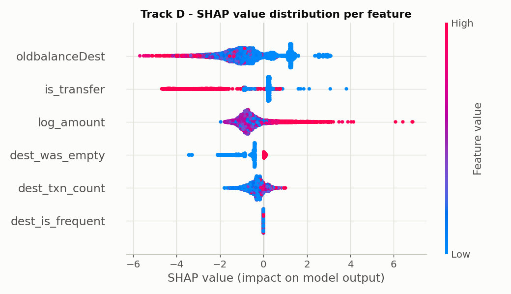
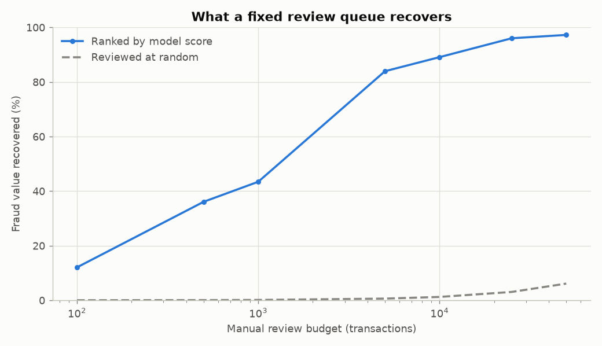

# Week 3 - Gradient boosting, anomaly detection, and cost

Week 2 established that most apparent performance on PaySim is leakage, and that
the honest feature set (Track D) supports only weak models. This week tests
whether a stronger learner changes that, whether fraud is findable without labels
at all, and at what threshold the model is worth running.

Hyperparameters were selected on a validation window carved from the **training**
period. Tuning against the test window would be a fourth form of leakage.

## XGBoost across the tracks

| Model | Precision | Recall | F1 | PR-AUC | TP | FP | FN |
|---|---|---|---|---|---|---|---|
| XGBoost - Track A (all features) | 0.9998 | 0.9998 | 0.9998 | 1.0000 | 4,569 | 1 | 1 |
| XGBoost - Track B (no origin drain) | 0.9409 | 0.6963 | 0.8003 | 0.7888 | 3,182 | 200 | 1,388 |
| XGBoost - Track C (no destination leak) | 0.7414 | 0.4354 | 0.5487 | 0.5412 | 1,990 | 694 | 2,580 |
| XGBoost - Track D (no timing artifact) | 0.4451 | 0.2615 | 0.3294 | 0.3260 | 1,195 | 1,490 | 3,375 |

### Against the Week 2 Random Forest

| Track | Random Forest (Week 2) | XGBoost (Week 3) | Change |
|---|---|---|---|
| Track A (all features) | 1.0000 | 1.0000 | -0.0000 |
| Track B (no origin drain) | 0.7836 | 0.7888 | +0.0052 |
| Track C (no destination leak) | 0.4229 | 0.5412 | +0.1183 |
| Track D (no timing artifact) | 0.1501 | 0.3260 | +0.1759 |

Gradient boosting materially outperforms the Random Forest on the honest feature set: **0.1501 -> 0.3260** on Track D, a 2.2x improvement. So the residual signal after the artifacts are stripped is real but highly non-linear - it needs a model capable of deep interactions to reach, which is why the linear and shallower models found so little of it.

This revises the Week 2 reading. The leakage was doing most of the work, but not all of it.

## Can fraud be found without labels?

| Model | Precision | Recall | F1 | PR-AUC | TP | FP | FN |
|---|---|---|---|---|---|---|---|
| IsolationForest (unsupervised, Track D) | 0.0445 | 0.5046 | 0.0818 | 0.0277 | 2,306 | 49,507 | 2,264 |

An IsolationForest trained only on legitimate transactions - never shown a fraud
label - scores **0.0277** PR-AUC against a no-skill floor of
0.0056, i.e. 5.0x better than random. That is far below the supervised model on identical features (0.3260), so labels are carrying most of the weight. Unsupervised detection is often proposed for fraud on the grounds that it catches novel patterns; on this data it is a weak substitute rather than a replacement, though it still beats random and would have some value where no labels exist at all.

## Where the residual signal lives (SHAP)

Mean absolute SHAP value per feature:

| Feature | Mean \|SHAP\| |
|---|---|
| `oldbalanceDest` | 1.2214 |
| `is_transfer` | 0.8177 |
| `log_amount` | 0.7663 |
| `dest_was_empty` | 0.4914 |
| `dest_txn_count` | 0.3586 |
| `dest_is_frequent` | 0.0000 |

## What it is worth operationally

A fraud team does not review everything above a threshold - it works a queue of
fixed size. So the useful question is not "what is the optimal cutoff" but: given
capacity to review K transactions, what does ranking by model score recover
compared with picking K at random?

This is where a weak model can still earn its keep. Ranking does not need to be
good to beat random selection, and the lift is a number an operations manager can
actually act on.

| Review budget | Frauds caught | % of fraud value | Precision | Lift vs random |
|---|---|---|---|---|
| 100 | 100 | 12.1% | 1.000 | 986.9x |
| 500 | 497 | 36.1% | 0.994 | 590.8x |
| 1,000 | 825 | 47.9% | 0.825 | 392.2x |
| 5,000 | 1,473 | 83.9% | 0.295 | 137.4x |
| 10,000 | 2,022 | 89.0% | 0.202 | 72.8x |
| 25,000 | 3,256 | 96.0% | 0.130 | 31.4x |
| 50,000 | 3,473 | 97.2% | 0.069 | 15.9x |

Total fraud exposure in the test window is **7,075,665,126**. Reviewing the
1,000 highest-scoring transactions recovers
**47.9%** of that value at
**392.2x** the return of reviewing the same number at random.

Break-even framing: at a budget of 1,000 reviews, the queue
recovers 3,390,269 of fraud value per
review performed. Any per-review cost below that figure makes the queue profitable -
which is the form of the answer a fraud operations lead needs, rather than a PR-AUC.

## Honest summary

On the honest feature set (Track D) the best model reaches **0.3260** PR-AUC against a 0.0056 no-skill floor - 58x better than random, but far below what the leaking feature sets appear to deliver. Judged as a ranker rather than a classifier it is considerably more useful: reviewing the 1,000 highest-scoring transactions (0.12% of the test window) recovers 47.9% of all fraud value.

The value of this project remains the audit that established how much of PaySim's
apparent difficulty is manufactured, plus an operational framing that says what the
resulting detector is worth in a review queue. Conclusions here characterise the
simulator, not production fraud.
